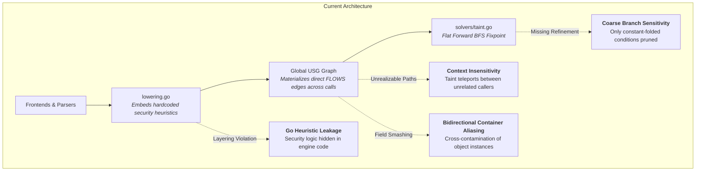
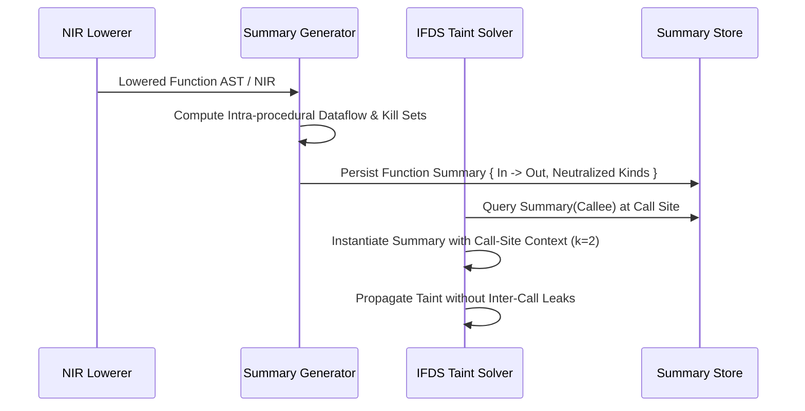

# VyQL Engine Improvement — Comprehensive Implementation Plan

> **For agentic workers:** REQUIRED SUB-SKILL: Use superpowers:subagent-driven-development or superpowers:executing-plans to implement this plan task-by-task. Steps use checkbox (`- [ ]`) syntax for tracking.

**Goal:** Transform the VyQL analysis engine from a flat reachability model into a production-grade, context-sensitive IFDS summary-based dataflow engine with bounded access paths, pure declarative separation, and modular incremental caching.

---

## 1. Executive Summary & Problem Statement

### Core Deficiencies in Current Architecture



1. **Context Insensitivity (CFL Violation):** Interprocedural calls materialize direct `FLOWS` edges from arguments to parameters, and from function returns to call sites. A shared helper called by both safe and tainted callers leaks taint to the safe caller (unrealizable paths).
2. **Architectural Leakage in `lowering.go`:** Over 1,500 lines of security checks (CORS headers, X-Frame-Options, debug config, ReDoS, SQL/command interpolation) are hardcoded in Go rather than declared in `.vyql` bindings.
3. **Coarse Heap & Container Aliasing:** Containers use bidirectional aliasing and smash all fields into a single dirty state upon unmodeled method invocations or dynamic index accesses.
4. **Coarse Branch Sensitivity:** Guards like `if (isValidUUID(x))` or `if (typeof x === "number")` are not recognized as branch-narrowing constraints without constant-folding.

---

## 2. Target Architecture

```mermaid
flowchart TD
    subgraph Next-Gen Architecture
        N1[Frontend Parsers] --> N2[NIR Construction<br/><i>SSA, CFG, Def-Use</i>]
        N2 --> N3[Pure NIR Lowering<br/><i>Zero Security Domain Logic</i>]
        N3 --> N4[Declarative Bindings Engine<br/><i>100% in .vyql definitions</i>]
        N4 --> N5[Intra-Procedural Function Summarizer<br/><i>Param(i) -> Ret, Field Access Paths</i>]
        N5 --> N6[Context-Sensitive IFDS Solver<br/><i>Call-String k=2 Stack Balancing</i>]
        N6 --> N7[Abstract Interpretation / Type Narrowing<br/><i>Branch Guard Refinement</i>]
        N7 --> N8[High-Precision Findings & Proof Trees]
    end
```

---

## 3. Implementation Phases and Task Breakdown

### Phase 1: Pure Declarative Separation (De-hardcoding `lowering.go`)

**Objective:** Move all security and framework heuristics from [internal/extract/lowering/lowering.go](internal/extract/lowering/lowering.go) into `.vyql` patterns, concepts, and bindings.

- [ ] **Task 1.1: Audit and Categorize Go-Hardcoded Heuristics**
  - Extract all instances of `l.syntheticCall`, `insecureHeaderStore`, `insecureHeaderPair`, `exposesInternalConfig`, `allowedHostsWildcard`, `certCheckDisabled`, and `enumerationErrorResponse`.
  - Create a specification matrix mapping each Go check to target `.vyql` concepts and bindings.

- [ ] **Task 1.2: Author Declarative `.vyql` Bindings & Concepts**
  - Add missing HTTP header and configuration concepts to [vyql/ontology/concepts/](vyql/ontology/concepts/).
  - Write declarative pattern matchers and bindings in [vyql/bindings/config/](vyql/bindings/config/) and framework-specific binding packages.
  - Test new bindings with `vyql definitions validate`.

- [ ] **Task 1.3: Refactor `lowering.go` to Remove Domain Logic**
  - Strip heuristic inspection functions from `lowering.go` and ensure lowering generates only pure AST/NIR graph representations (Class A facts).
  - Verify that no synthetic analysis nodes are generated inside `lowering.go`.

- [ ] **Task 1.4: Conformance & Regression Verification**
  - Run full test suite: `go test -count=1 ./...`.
  - Ensure zero finding regressions on `BenchmarkJava`, `BenchmarkPython`, and `owasp-js`.

---

### Phase 2: Context-Sensitive IFDS Function Summaries

**Objective:** Replace direct interprocedural `FLOWS` edge materialization with an on-demand summary-based IFDS solver to eliminate unrealizable paths.



- [ ] **Task 2.1: Define Function Summary Data Structures**
  - Implement `FunctionSummary` in [internal/solvers/](internal/solvers/):
    ```go
    type FlowSummary struct {
        ParamToReturn map[int]bool
        ParamToParam  map[int][]int
        ParamToField  map[int]map[string]bool
        FieldToReturn map[string]bool
        KilledThreats map[int]map[string]bool
    }
    ```

- [ ] **Task 2.2: Implement Intra-Procedural Summary Generator**
  - Analyze intra-procedural SSA def-use chains per function to extract transfer relations from parameters to return values and mutated reference parameters.
  - Track neutralizing controls encountered along internal paths to record killed threat kinds per parameter.

- [ ] **Task 2.3: Implement Context-Sensitive IFDS Solver ($k$-CFA)**
  - Refactor `FindTaintFlows` in [internal/solvers/taint.go](internal/solvers/taint.go) to maintain call-string call stacks of bounded depth ($k=2$).
  - At call sites, query the callee summary instead of following flat cross-function `FLOWS` edges.
  - Ensure return facts return exclusively to the corresponding call site.

- [ ] **Task 2.4: Test Suite & Real-World Validation**
  - Add unit tests for shared helper functions with mixed clean/tainted callers.
  - Verify elimination of cross-callsite false positives on real vulnerability suites.

---

### Phase 3: Bounded Access Paths & Directional Heap Modeling

**Objective:** Prevent field-smashing and eliminate bidirectional reference contamination in container and object tracking.

- [ ] **Task 3.1: Implement Access Path Representation**
  - Define `AccessPath` struct:
    ```go
    type AccessPath struct {
        BaseNode string
        Fields   []string
        Smash    bool
    }
    ```
  - Enforce access-path depth limit: when $\text{depth} > 3$, mark path as smashed ($\pi = \text{smash}(\pi)$).

- [ ] **Task 3.2: Directional Mutation Summaries**
  - Replace bidirectional `aliasReceiverSelf` with directional parameter-effect summaries.
  - When a function mutates `param.field`, emit an explicit output effect node rather than collapsing caller and callee object identities.

- [ ] **Task 3.3: Container Index Refinement**
  - Support constant string/integer keys without collapsing entire map/slice containers.
  - Fall back to field smashing only on dynamic/non-constant mutations.

---

### Phase 4: Lightweight Type & Predicate Narrowing

**Objective:** Recognize defensive programming and branch-guard patterns without requiring constant folding.

- [ ] **Task 4.1: Abstract Interpretation Domains for Branch Conditions**
  - Implement a lightweight abstract state for variables in [internal/extract/lowering/](internal/extract/lowering/):
    - **Type Set:** `{string, number, boolean, null, undefined, object}`.
    - **Nullability:** `NonNull`, `Nullable`, `Null`.
    - **Length Range:** `[min, max]` intervals for strings/arrays.

- [ ] **Task 4.2: Branch Filtering & Guard Synthesis**
  - On `nir.If` and `nir.Ternary` `Then` branches, apply type/nullability narrowing (e.g., `typeof x === "number"` removes taint from `x` on `Then` branch).
  - Recognize standard validation predicates (`isNumeric`, `isUUID`, `isAlphanumeric`) and synthesize neutralizing check concepts.

---

### Phase 5: Modular Summary Caching & Performance Scaling

**Objective:** Achieve sub-second incremental re-scans on large enterprise codebases.

- [ ] **Task 5.1: Content-Addressed Function Summary Caching**
  - Key function summaries by cryptographic hash of the function's NIR AST and referenced global types (`SHA-256(NIR(fn))`).
  - Store serialized summaries in BadgerDB / persistent cache ([internal/extract/parsecache/](internal/extract/parsecache/)).

- [ ] **Task 5.2: Dependency Invalidation Graph**
  - Maintain a lightweight reverse call graph.
  - When a file is modified, recompute summaries only for altered functions and propagate invalidations up the caller hierarchy.

- [ ] **Task 5.3: Benchmarking and Profiling**
  - Benchmark full scan vs. incremental scan times on 100k+ LOC projects.
  - Profile memory usage to ensure peak resident set size (RSS) stays within soft limits (`-max-ram`).

---

## 4. Protected Baselines & Quality Gates

Any commit or PR implementing this plan must satisfy the following strict quality gates:

1. **Compilation & Hygiene:**
   ```sh
   make fmt
   make lint
   make hygiene
   ```
2. **Deterministic Full Test Suite:**
   ```sh
   go test -count=1 ./...
   ```
3. **Protected Precision & Recall Baselines:**
   - `BenchmarkJava`: **$\ge +1.00$**
   - `BenchmarkPython`: **$\ge +0.90$**
   - `owasp-js`: **$\ge +1.00$**
   - `RealVuln (62 repos)`: True Positive count must not decrease; False Positive count must decrease or remain constant.

---

## 5. File & Component Change Matrix

| Component / Package | Current Implementation | Planned Changes |
|---|---|---|
| [internal/extract/lowering/lowering.go](internal/extract/lowering/lowering.go) | Contains Go-hardcoded security heuristics and bidirectional aliasing | Strip security checks into `.vyql`; implement directional mutation lowering |
| [internal/solvers/taint.go](internal/solvers/taint.go) | Flat forward reachability BFS over `FLOWS` edges | IFDS summary-based solver with $k=2$ call-string context sensitivity |
| [internal/solvers/](internal/solvers/) | Single-file reach/taint solvers | Add `summary.go`, `accesspath.go`, `context.go` |
| [internal/extract/lowering/validation.go](internal/extract/lowering/validation.go) | Basic constant folding | Lightweight abstract interpretation and type/nullability narrowing |
| [internal/extract/parsecache/](internal/extract/parsecache/) | Per-file AST token cache | Add persistent function summary store with content-addressing |
| [vyql/ontology/](vyql/ontology/) & [vyql/bindings/](vyql/bindings/) | Framework bindings | Add full declarative coverage for all migrated Go heuristics |